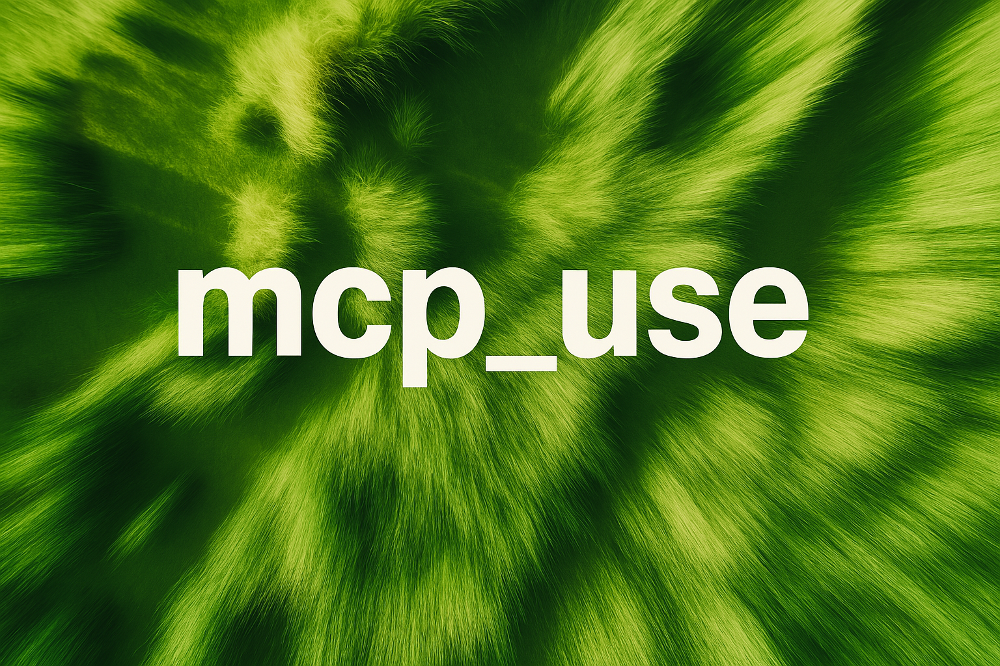

<picture>
  
</picture>

<h1 align="center">Open Source MCP CLient Library </h1>

[](https://pypi.org/project/mcp_use/)
[](https://pypi.org/project/mcp_use/)
[](https://pypi.org/project/mcp_use/)
[](https://pypi.org/project/mcp_use/)
[](https://github.com/pietrozullo/mcp-use/blob/main/LICENSE)
[](https://github.com/astral-sh/ruff)
[](https://github.com/pietrozullo/mcp-use/stargazers)

🌐 MCP-Use is the open source way to connect any LLM to MCP tools and build custom agents that have tool access, without using closed source or application clients.

💡 Let developers easily connect any LLM to tools like web browsing, file operations, and more.

# Quick start

With pip:

```bash
pip install mcp-use
```

Or install from source:

```bash
git clone https://github.com/pietrozullo/mcp-use.git
cd mcp-use
pip install -e .
```

Spin up your agent:

```python
import asyncio
import os
from dotenv import load_dotenv
from langchain_openai import ChatOpenAI
from mcp_use import MCPAgent, MCPClient

async def main():
    # Load environment variables
    load_dotenv()

    # Create MCPClient from config file
    client = MCPClient.from_config_file("browser_mcp.json")

    # Create LLM
    llm = ChatOpenAI(model="gpt-4o")

    # Create agent with the client
    agent = MCPAgent(llm=llm, client=client, max_steps=30)

    # Run the query
    result = await agent.run(
        "Find the best restaurant in San Francisco USING GOOGLE SEARCH",
    )
    print(f"\nResult: {result}")

if __name__ == "__main__":
    asyncio.run(main())
```

Example configuration file (`browser_mcp.json`):

```json
{
  "mcpServers": {
    "playwright": {
      "command": "npx",
      "args": ["@playwright/mcp@latest"],
      "env": {
        "DISPLAY": ":1"
      }
    }
  }
}
```

Add your API keys for the provider you want to use to your `.env` file.

```bash
OPENAI_API_KEY=
ANTHROPIC_API_KEY=
```

For other settings, models, and more, check out the documentation.

# Example Use Cases

## Web Browsing with Playwright

```python
import asyncio
import os
from dotenv import load_dotenv
from langchain_openai import ChatOpenAI
from mcp_use import MCPAgent, MCPClient

async def main():
    # Load environment variables
    load_dotenv()

    # Create MCPClient from config file
    client = MCPClient.from_config_file(
        os.path.join(os.path.dirname(__file__), "browser_mcp.json")
    )

    # Create LLM
    llm = ChatOpenAI(model="gpt-4o")
    # Alternative models:
    # llm = ChatAnthropic(model="claude-3-5-sonnet-20240620")
    # llm = ChatGroq(model="llama3-8b-8192")

    # Create agent with the client
    agent = MCPAgent(llm=llm, client=client, max_steps=30)

    # Run the query
    result = await agent.run(
        "Find the best restaurant in San Francisco USING GOOGLE SEARCH",
        max_steps=30,
    )
    print(f"\nResult: {result}")

if __name__ == "__main__":
    asyncio.run(main())
```

## Airbnb Search

```python
import asyncio
import os
from dotenv import load_dotenv
from langchain_anthropic import ChatAnthropic
from mcp_use import MCPAgent, MCPClient

async def run_airbnb_example():
    # Load environment variables
    load_dotenv()

    # Create MCPClient with Airbnb configuration
    client = MCPClient.from_config_file(
        os.path.join(os.path.dirname(__file__), "airbnb_mcp.json")
    )

    # Create LLM - you can choose between different models
    llm = ChatAnthropic(model="claude-3-5-sonnet-20240620")

    # Create agent with the client
    agent = MCPAgent(llm=llm, client=client, max_steps=30)

    try:
        # Run a query to search for accommodations
        result = await agent.run(
            "Find me a nice place to stay in Barcelona for 2 adults "
            "for a week in August. I prefer places with a pool and "
            "good reviews. Show me the top 3 options.",
            max_steps=30,
        )
        print(f"\nResult: {result}")
    finally:
        # Ensure we clean up resources properly
        if client.sessions:
            await client.close_all_sessions()

if __name__ == "__main__":
    asyncio.run(run_airbnb_example())
```

Example configuration file (`airbnb_mcp.json`):

```json
{
  "mcpServers": {
    "airbnb": {
      "command": "npx",
      "args": ["-y", "@openbnb/mcp-server-airbnb"]
    }
  }
}
```

## Blender 3D Creation

```python
import asyncio
from dotenv import load_dotenv
from langchain_anthropic import ChatAnthropic
from mcp_use import MCPAgent, MCPClient

async def run_blender_example():
    # Load environment variables
    load_dotenv()

    # Create MCPClient with Blender MCP configuration
    config = {"mcpServers": {"blender": {"command": "uvx", "args": ["blender-mcp"]}}}
    client = MCPClient.from_dict(config)

    # Create LLM
    llm = ChatAnthropic(model="claude-3-5-sonnet-20240620")

    # Create agent with the client
    agent = MCPAgent(llm=llm, client=client, max_steps=30)

    try:
        # Run the query
        result = await agent.run(
            "Create an inflatable cube with soft material and a plane as ground.",
            max_steps=30,
        )
        print(f"\nResult: {result}")
    finally:
        # Ensure we clean up resources properly
        if client.sessions:
            await client.close_all_sessions()

if __name__ == "__main__":
    asyncio.run(run_blender_example())
```

# Configuration File Support

MCP-Use supports initialization from configuration files, making it easy to manage and switch between different MCP server setups:

```python
import asyncio
from mcp_use import create_session_from_config

async def main():
    # Create an MCP session from a config file
    session = create_session_from_config("mcp-config.json")

    # Initialize the session
    await session.initialize()

    # Use the session...

    # Disconnect when done
    await session.disconnect()

if __name__ == "__main__":
    asyncio.run(main())
```

## Roadmap
<ul>
<li>[ ] Multiple Servers at once </li>
<li>[ ] Test remote connectors (http, ws)</li>
<li>[ ] ... </li>
</ul>

## Contributing

We love contributions! Feel free to open issues for bugs or feature requests.

## Requirements

- Python 3.11+
- MCP implementation (like Playwright MCP)
- LangChain and appropriate model libraries (OpenAI, Anthropic, etc.)

## Citation

If you use MCP-Use in your research or project, please cite:

```bibtex
@software{mcp_use2025,
  author = {Zullo, Pietro},
  title = {MCP-Use: MCP Library for Python},
  year = {2025},
  publisher = {GitHub},
  url = {https://github.com/pietrozullo/mcp-use}
}
```

## License

MIT
