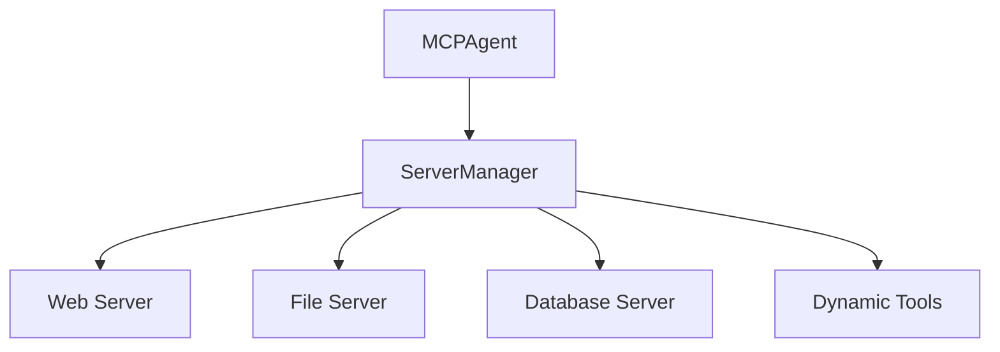
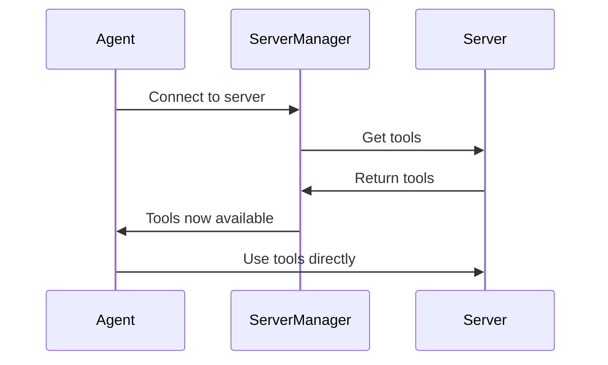

# Server Manager: Dynamic Multi-Server Intelligence

The Server Manager is the brain behind intelligent MCP server orchestration. It transforms your agent from a static tool user into a dynamic, adaptive assistant that can discover, connect to, and intelligently utilize tools from multiple MCP servers on-demand.

## 🎯 What Makes It Special

Instead of overwhelming your agent with hundreds of tools from all servers at once, the Server Manager:

- **Dynamically loads tools** only when needed, with full schemas
- **Intelligently discovers** the right server for each task
- **Automatically updates** available tools as connections change
- **Provides semantic search** across all server tools
- **Manages connection lifecycle** efficiently

## 🏗️ Architecture Overview



## 🔄 Dynamic Tool Loading Process



## 🚀 Getting Started

Enable the Server Manager in your agent:

<CodeGroup>
```python Python
from mcp_use import MCPClient, MCPAgent
from langchain_openai import ChatOpenAI

# Create client with multiple servers
client = MCPClient.from_dict({
    "mcpServers": {
        "playwright": {
            "command": "npx",
            "args": ["@playwright/mcp@latest"]
        },
        "filesystem": {
            "command": "uvx",
            "args": ["mcp-server-filesystem", "/tmp"]
        }
    }
})

# 🎯 Enable Server Manager
agent = MCPAgent(
    llm=ChatOpenAI(model="gpt-4"),
    client=client,
    use_server_manager=True  # ✨ This is the magic switch!
)
```

```typescript TypeScript
import { MCPClient, MCPAgent } from 'mcp-use'
import { ChatOpenAI } from '@langchain/openai'

// Create client with multiple servers
const client = new MCPClient({
    mcpServers: {
        playwright: {
            command: 'npx',
            args: ['@playwright/mcp@latest']
        },
        filesystem: {
            command: 'uvx',
            args: ['mcp-server-filesystem', '/tmp']
        }
    }
})

// 🎯 Enable Server Manager
const agent = new MCPAgent({
    llm: new ChatOpenAI({ model: 'gpt-4' }),
    client,
    useServerManager: true  // ✨ This is the magic switch!
})
```
</CodeGroup>


## 🔍 Tool Discovery Flow


## 🛠️ Management Tools Deep Dive

### Core Server Management

| Tool | Purpose | Example |
|------|---------|---------|
| `list_mcp_servers` | Discovery of available servers and their tools | "What servers do I have access to?" |
| `connect_to_mcp_server` | Activate a server and load its tools | "Connect to the filesystem server" |
| `get_active_mcp_server` | Check current connection status | "Which server am I currently using?" |
| `disconnect_from_mcp_server` | Deactivate server and remove its tools | "Disconnect from current server" |
| `search_mcp_tools` | Semantic search across all server tools | "Find tools for image processing" |

### Smart Tool Search Example

<CodeGroup>
```python Python
# Agent automatically discovers and uses the right tools
result = await agent.run("""
I need to:
1. Find tools for web scraping
2. Connect to the right server
3. Scrape data from https://example.com
4. Save it to a file

Start by searching for relevant tools.
""")
```

```typescript TypeScript
// Agent automatically discovers and uses the right tools
const result = await agent.run(`
I need to:
1. Find tools for web scraping
2. Connect to the right server
3. Scrape data from https://example.com
4. Save it to a file

Start by searching for relevant tools.
`)
```
</CodeGroup>

**Agent Process:**


## 🎭 Real-World Use Cases

### 1. Multi-Server Data Pipeline

<CodeGroup>
```python Python
result = await agent.run("""
Create a data pipeline that:
1. Scrapes product data from an e-commerce site
2. Processes and cleans the data
3. Saves it to a CSV file
4. Loads it into a SQLite database

Figure out which servers and tools you need.
""")
```

```typescript TypeScript
const result = await agent.run(`
Create a data pipeline that:
1. Scrapes product data from an e-commerce site
2. Processes and cleans the data
3. Saves it to a CSV file
4. Loads it into a SQLite database

Figure out which servers and tools you need.
`)
```
</CodeGroup>

**Server Flow:**
```
playwright → filesystem → database
    ↓            ↓          ↓
 scraping → save CSV → load data
```

### 2. Content Creation Workflow

<CodeGroup>
```python Python
result = await agent.run("""
I want to:
1. Search for trending topics online
2. Generate an image based on the topic
3. Write a blog post about it
4. Save everything to files

What tools do I need for this?
""")
```

```typescript TypeScript
const result = await agent.run(`
I want to:
1. Search for trending topics online
2. Generate an image based on the topic
3. Write a blog post about it
4. Save everything to files

What tools do I need for this?
`)
```
</CodeGroup>

## 🚀 Performance Benefits

The Server Manager provides focused tool access:

- **Without Server Manager**: All 100+ tools from all servers loaded at once, overwhelming the model
- **With Server Manager**: Only 5-15 relevant tools from the active server, providing clear focus

##  Core Features

The Server Manager provides these powerful capabilities:

- **🔗 Dynamic Tool Addition**: Server tools automatically added with full schemas
- **⚡ Real-time Updates**: Tool list updates immediately when connecting/disconnecting
- **🧹 Clean Architecture**: Direct tool access with proper schemas
- **🎯 Model Understanding**: Tools come with native schemas and validation
- **📊 Smart Logging**: Detailed insights into tool changes and server status

## 🏁 Complete Example

<CodeGroup>
```python Python
import asyncio
from mcp_use import MCPClient, MCPAgent
from langchain_openai import ChatOpenAI

async def demo_server_manager():
    # Multi-server configuration
    client = MCPClient.from_dict({
        "mcpServers": {
            "web": {"command": "npx", "args": ["@playwright/mcp@latest"]},
            "files": {"command": "uvx", "args": ["mcp-server-filesystem", "/tmp"]},
            "database": {"command": "uvx", "args": ["mcp-server-sqlite"]}
        }
    })

    # Agent with Server Manager
    agent = MCPAgent(
        llm=ChatOpenAI(model="gpt-4"),
        client=client,
        use_server_manager=True,
        verbose=True  # See the magic happen!
    )

    # Complex multi-server task
    result = await agent.run("""
    I need to build a complete data collection system:

    1. First, show me what servers and tools are available
    2. Scrape product information from https://example-store.com
    3. Clean and structure the data
    4. Save it as both JSON and CSV files
    5. Load the data into a SQLite database
    6. Generate a summary report

    Guide me through each step and show me how you discover and use the right tools.
    """)

    print("🎉 Task completed!")
    print(result)

    await agent.close()

if __name__ == "__main__":
    asyncio.run(demo_server_manager())
```

```typescript TypeScript
import { MCPClient, MCPAgent } from 'mcp-use'
import { ChatOpenAI } from '@langchain/openai'

async function demoServerManager() {
    // Multi-server configuration
    const client = new MCPClient({
        mcpServers: {
            web: { command: 'npx', args: ['@playwright/mcp@latest'] },
            files: { command: 'uvx', args: ['mcp-server-filesystem', '/tmp'] },
            database: { command: 'uvx', args: ['mcp-server-sqlite'] }
        }
    })

    // Agent with Server Manager
    const agent = new MCPAgent({
        llm: new ChatOpenAI({ model: 'gpt-4' }),
        client,
        useServerManager: true,
        verbose: true  // See the magic happen!
    })

    // Complex multi-server task
    const result = await agent.run(`
    I need to build a complete data collection system:

    1. First, show me what servers and tools are available
    2. Scrape product information from https://example-store.com
    3. Clean and structure the data
    4. Save it as both JSON and CSV files
    5. Load the data into a SQLite database
    6. Generate a summary report

    Guide me through each step and show me how you discover and use the right tools.
    `)

    console.log('🎉 Task completed!')
    console.log(result)

    await client.closeAllSessions()
}

demoServerManager().catch(console.error)
```
</CodeGroup>

The Server Manager transforms your MCP agent from a static tool user into an intelligent, adaptive assistant that can dynamically discover and utilize the perfect tools for any task! 🚀


## Bring Your Own Server Manager

For ultimate control, you can create your own server manager. By implementing the `BaseServerManager` abstract class, you can define custom logic for tool discovery, dynamic tool creation, or integration with other systems. The server manager's primary role is to provide tools **to the agent**. These can be management tools for connecting to external MCP servers, or, as shown below, custom tools that operate entirely within the agent's environment without needing an external server.

Here’s a minimal example of a custom server manager that provides a single, hard-coded tool directly to the agent.

```python
import asyncio
from mcp_use.agents import MCPAgent
from mcp_use.managers.base import BaseServerManager
from langchain_core.tools import BaseTool
from langchain_openai import ChatOpenAI
from pydantic import BaseModel

# 1. Define a custom tool
class HelloWorldTool(BaseTool):
    """A simple tool that returns a greeting."""
    name: str = "hello_world"
    description: str = "Returns 'Hello, World!'"
    args_schema: type[BaseModel] | None = None
    def _run(self) -> str: return "Hello, World!"
    async def _arun(self) -> str: return "Hello, World!"

# 2. Implement the BaseServerManager interface
class SimpleServerManager(BaseServerManager):
    """A minimal server manager with one tool."""
    def __init__(self):
        self._tools = [HelloWorldTool()]
    async def initialize(self) -> None: pass
    @property
    def tools(self) -> list[BaseTool]: return self._tools
    def has_tool_changes(self, current_tool_names: set[str]) -> bool:
        return {tool.name for tool in self.tools} != current_tool_names

# 3. Pass your custom manager to the agent
async def useCustomManager():
    agent = MCPAgent(
        llm=ChatOpenAI(model="gpt-4o"),
        use_server_manager=True,
        server_manager=SimpleServerManager(),
    )
    # The agent now has access to your custom tool
    result = await agent.run("Use the hello_world tool")
    print(result) #> "Hello, World!"
    await agent.close()

asyncio.run(useCustomManager())
```
