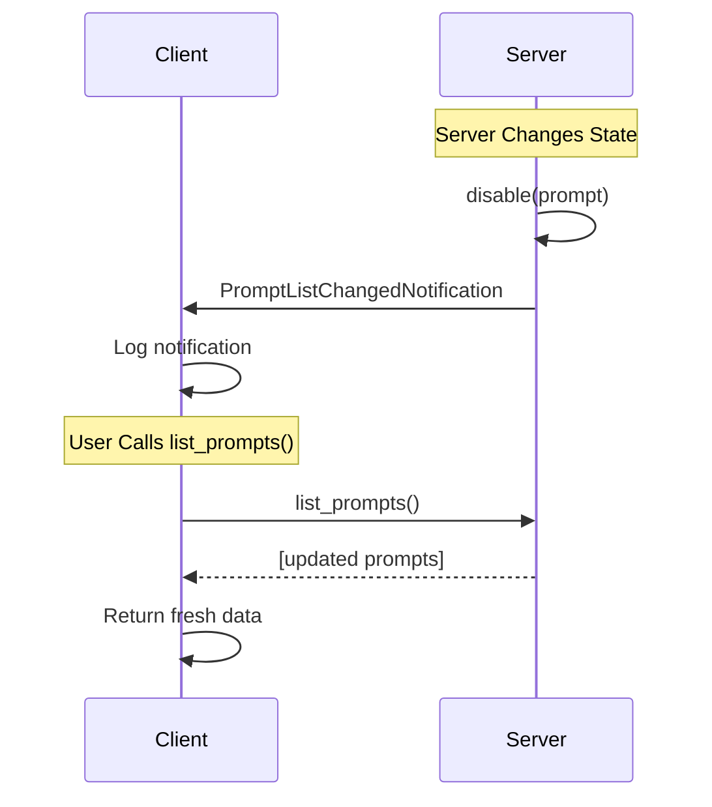

# Prompts

Prompts in MCP are reusable templates for structured interactions between AI models and servers. They provide predefined interaction patterns with parameters, enabling consistent and efficient communication for common use cases.

## What are Prompts?

Prompts are interaction templates with:
- **User-controlled invocation** requiring explicit activation
- **Parameter definitions** for customizable inputs
- **Structured formats** for consistent interactions
- **Context-aware content** that can adapt to different scenarios

Common examples include:
- Task planning templates ("Plan a vacation")
- Code review workflows ("Review this pull request")
- Content generation patterns ("Write a blog post about...")
- Analysis frameworks ("Analyze market trends for...")
- Decision support templates ("Compare options for...")

## Characteristics of Prompts

### User Control
Prompts are never invoked automatically - they require explicit user activation, ensuring transparency and control over AI interactions.

### Parameter Support
Prompts can accept parameters to customize their behavior and adapt to specific contexts.

### Reusability
Well-designed prompts can be reused across different contexts and conversations.

## Listing Available Prompts

To see what prompts are available from a connected MCP server:

```python
import asyncio
from mcp_use import MCPClient

async def list_prompts():
    # Initialize client with server configuration
    config = {
        "mcpServers": {
            # Your server definitions here
        }
    }
    client = MCPClient(config)

    # Connect to servers
    await client.create_all_sessions()

    # Get a session for a specific server
    session = client.get_session("my_server")

    # List all available prompts - always returns fresh data
    prompts = await session.list_prompts()

    for prompt in prompts:
        print(f"Prompt: {prompt.name}")
        print(f"Description: {prompt.description}")
        if prompt.arguments:
            print("Arguments:")
            for arg in prompt.arguments:
                print(f"  - {arg.name}: {arg.description}")
        print("---")


# Run the example
asyncio.run(list_prompts())
```

### Automatic Prompt List Update

When servers send `PromptListChangedNotification`, it signals that the prompt list has changed. The `list_prompts()` method always fetches fresh data from the server, ensuring you get up-to-date information.



**Important:** Always use `await session.list_prompts()` instead of the deprecated `session.prompts` property to ensure you get fresh data:

```python
# ✅ Recommended - always returns fresh data
prompts = await session.list_prompts()

# ⚠️ Deprecated - may return stale data
# prompts = session.prompts
```

## Getting and Using Prompts

Prompts are retrieved using the `get_prompt` method:

```python
import asyncio
from mcp_use import MCPClient

async def use_prompt_example():
    config = {
        "mcpServers": {
            # Your server definitions here
        }
    }
    client = MCPClient(config)
    await client.create_all_sessions()

    session = client.get_session("planning_server")

    # Get a prompt with arguments
    result = await session.get_prompt(
        name="plan_vacation",
        arguments={
            "destination": "Japan",
            "duration": "2 weeks",
            "budget": "$5000",
            "interests": ["culture", "food", "nature"]
        }
    )

    # Use the prompt content
    print(f"Prompt description: {result.description}")
    for message in result.messages:
        print(f"Role: {message.role}")
        print(f"Content: {message.content.text}")


asyncio.run(use_prompt_example())
```

## Prompt Without Arguments

Some prompts don't require parameters:

```python
async def simple_prompt_example():
    config = {
        "mcpServers": {
            # Your server definitions here
        }
    }
    client = MCPClient(config)
    await client.create_all_sessions()

    session = client.get_session("content_server")

    # Get a prompt without arguments
    result = await session.get_prompt(name="writing_tips")

    # Display the prompt content
    for message in result.messages:
        print(f"{message.role}: {message.content.text}")


asyncio.run(simple_prompt_example())
```

## Prompt Structure

Prompts return structured content with messages:

```python
# Example of working with prompt results
result = await session.get_prompt("code_review", {"language": "python"})

for message in result.messages:
    # Messages have roles (e.g., "user", "assistant", "system")
    role = message.role

    # Content can be text or other formats
    if hasattr(message.content, 'text'):
        text_content = message.content.text
        print(f"{role}: {text_content}")

    # Handle other content types if needed
    if hasattr(message.content, 'image'):
        print(f"{role}: [Image content]")
```

## Parameter Completion

Many prompts support parameter completion to help users understand required inputs:

```python
async def explore_prompt_parameters():
    session = client.get_session("my_server")
    prompts = await session.list_prompts()

    for prompt in prompts:
        print(f"Prompt: {prompt.name}")
        if prompt.arguments:
            print("Required parameters:")
            for arg in prompt.arguments:
                required = "required" if arg.required else "optional"
                print(f"  - {arg.name} ({required}): {arg.description}")
        print()
```

## Dynamic Prompt Generation

Some prompts can generate different content based on context:

```python
async def dynamic_prompt_example():
    config = {
        "mcpServers": {
            # Your server definitions here
        }
    }
    client = MCPClient(config)
    await client.create_all_sessions()

    session = client.get_session("adaptive_server")

    # Same prompt with different parameters
    contexts = [
        {"domain": "healthcare", "complexity": "beginner"},
        {"domain": "finance", "complexity": "expert"}
    ]

    for context in contexts:
        result = await session.get_prompt("domain_analysis", context)
        print(f"Analysis for {context['domain']}:")
        for message in result.messages:
            print(f"  {message.content.text[:100]}...")
        print()

```

## Error Handling

Handle potential errors when working with prompts:

```python
try:
    result = await session.get_prompt("missing_prompt", {"param": "value"})
    for message in result.messages:
        print(message.content.text)
except Exception as e:
    print(f"Failed to get prompt: {e}")

# Check if prompt exists before using
available_prompts = await session.list_prompts()
prompt_names = [p.name for p in available_prompts]

if "my_prompt" in prompt_names:
    result = await session.get_prompt("my_prompt")
else:
    print("Prompt not available")
```
