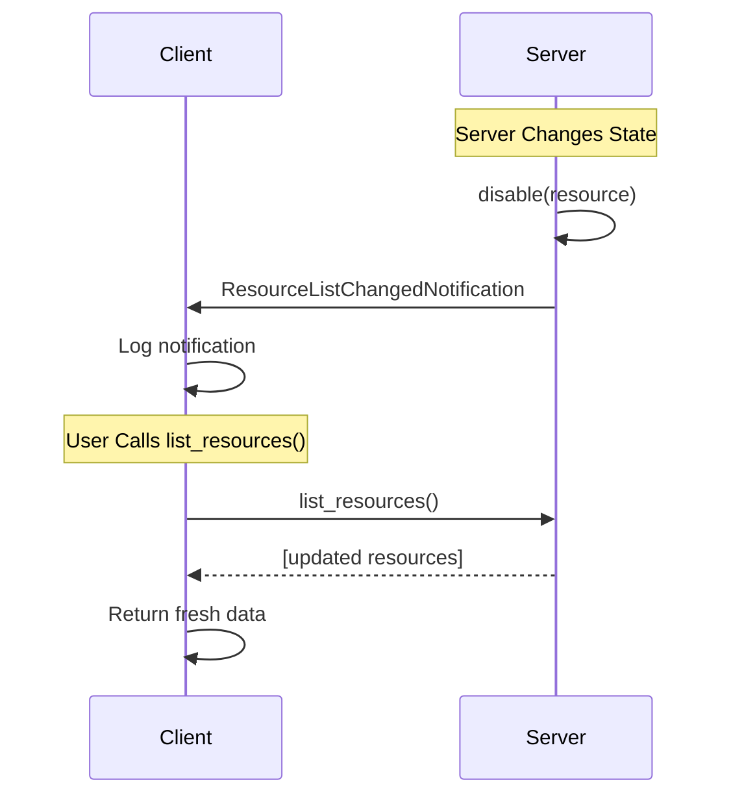

# Resources

Resources in MCP provide structured access to information that AI models need to understand context. They represent data sources that can be retrieved and used by AI applications, such as files, database records, API responses, or any other structured information.

## What are Resources?

Resources are context data sources with:
- **URI-based identification** for consistent addressing
- **Structured access patterns** with defined schemas
- **Multiple content types** (text, JSON, binary data)
- **Dynamic or static content** that can change over time

Common examples include:
- Configuration files and documents
- Database records and query results
- API responses and external data
- Calendar events and schedules
- User preferences and settings

## Types of Resources

### Direct Resources
Static resources with fixed URIs that always return the same type of content.

### Resource Templates
Dynamic resources that accept parameters to generate different content based on input.

## Listing Available Resources

To see what resources are available from a connected MCP server:

```python
import asyncio
from mcp_use import MCPClient

async def list_resources():
    # Initialize client with server configuration
    config = {
        "mcpServers": {
            # Your server definitions here
        }
    }
    client = MCPClient(config)

    # Connect to servers
    await client.connect()

    # Get a session for a specific server
    session = client.get_session("my_server")

    # List all available resources - always returns fresh data
    resources = await session.list_resources()

    for resource in resources:
        print(f"Resource: {resource.name}")
        print(f"URI: {resource.uri}")
        print(f"Description: {resource.description}")
        print(f"MIME Type: {resource.mimeType}")
        print("---")

    await client.disconnect()

# Run the example
asyncio.run(list_resources())
```

### Automatic Resource List Update

When servers send `ResourceListChangedNotification`, it signals that the resource list has changed. The `list_resources()` method always fetches fresh data from the server, ensuring you get up-to-date information.



**Important:** Always use `await session.list_resources()` instead of the deprecated `session.resources` property to ensure you get fresh data:

```python
# ✅ Recommended - always returns fresh data
resources = await session.list_resources()

# ⚠️ Deprecated - may return stale data
# resources = session.resources
```

## Reading Resources

Resources are accessed using the `read_resource` method with their URI:

```python
import asyncio
from mcp_use import MCPClient
from pydantic import HttpUrl

async def read_resource_example():
    config = {
        "mcpServers": {
            # Your server definitions here
        }
    }
    client = MCPClient(config)
    await client.connect()

    session = client.get_session("file_server")

    # Read a resource by URI
    resource_uri = HttpUrl("file:///path/to/config.json")
    result = await session.read_resource(resource_uri)

    # Handle the result
    for content in result.contents:
        if content.mimeType == "application/json":
            print(f"JSON content: {content.text}")
        elif content.mimeType == "text/plain":
            print(f"Text content: {content.text}")
        else:
            print(f"Binary content length: {len(content.blob)}")

    await client.disconnect()

asyncio.run(read_resource_example())
```

## Working with Resource Templates

Resource templates allow dynamic content generation based on parameters:

```python
import asyncio
from mcp_use import MCPClient
from pydantic import HttpUrl

async def template_resource_example():
    config = {
        "mcpServers": {
            # Your server definitions here
        }
    }
    client = MCPClient(config)
    await client.connect()

    session = client.get_session("database_server")

    # Access a parameterized resource
    # Template URI might be: "db://users/{user_id}/profile"
    resource_uri = HttpUrl("db://users/12345/profile")
    result = await session.read_resource(resource_uri)

    # Process the user profile data
    for content in result.contents:
        print(f"User profile: {content.text}")

    await client.disconnect()

asyncio.run(template_resource_example())
```

## Resource Content Types

Resources can contain different types of content:

### Text Content
```python
# Text-based resources (JSON, XML, plain text)
result = await session.read_resource(HttpUrl("file:///config.json"))

for content in result.contents:
    if hasattr(content, 'text'):
        print(f"Text content: {content.text}")
        print(f"MIME type: {content.mimeType}")
```

### Binary Content
```python
# Binary resources (images, files, etc.)
result = await session.read_resource(HttpUrl("file:///image.png"))

for content in result.contents:
    if hasattr(content, 'blob'):
        print(f"Binary data size: {len(content.blob)} bytes")
        # Save or process binary data
        with open("downloaded_image.png", "wb") as f:
            f.write(content.blob)
```

## Resource Discovery

Find resources matching specific criteria:

```python
async def find_resources():
    session = client.get_session("my_server")
    resources = await session.list_resources()

    # Find JSON configuration files
    config_resources = [
        r for r in resources
        if r.mimeType == "application/json"
        and "config" in r.name.lower()
    ]

    for resource in config_resources:
        print(f"Found config: {resource.name} at {resource.uri}")
```

## Error Handling

Always handle potential errors when reading resources:

```python
try:
    result = await session.read_resource(HttpUrl("file:///missing.txt"))
    for content in result.contents:
        print(f"Content: {content.text}")
except Exception as e:
    print(f"Failed to read resource: {e}")
```
